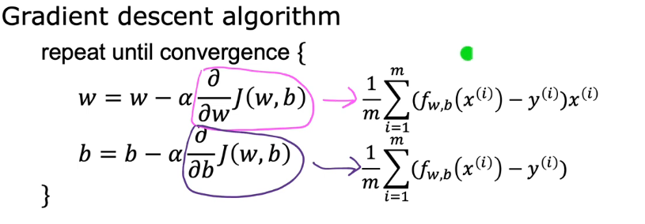

Machine Learning Specialist course - Andrew Ng https://www.youtube.com/playlist?list=PLkDaE6sCZn6FNC6YRfRQc_FbeQrF8BwGI

Supervised Learning (X -> y)
    Example: spam filtering, speech recognition, machine translation, visual inspection
    Classification: limited categories
    Regression: predict on a scale (infinite possibilities)
        Models: 
            Linear Regression: predict value based on a best fitting straight line

Unsupervised Learning (no right answer, find something interesting in unlabeled data)
    Example: Google News, grouping customers
    Clustering

Squared Error Cost Function

Gradient Descent Algorithm

As derivative becomes smaller, update steps become smaller
Batch gradient descent: each step of gradient descent uses all the training examples
