# ML intro learning textbook 
## @ http://ciml.info/ as recommended as a pre-requisite for https://web.stanford.edu/class/cs224n/

## Ch1: Decision Trees

What does it mean to learn? 
To be able to generalize, ie. use what you learned and be able to apply it to something similar

Training data: algorithm learns from
Test set: a final exam for the algorithm

Decision Tree: 
The goal in learning is figuring out what questions to ask, in what order to ask them, and what answer to predict once you've asked them. 
Feature: questions you can ask
Feature values: responses to the question

Variations of Decision Trees: 
Shallow decision tree: have a pre-defined maximum depth d, and once it queried on d many features, we must make a guess

Loss function: measure how off a system's prediction is in comparison to the truth
    Regression: Squared loss or Absolute loss
    Binary Classification: 0/1 loss
    Multiclass classification: 0/1 loss
    0/1 loss function: counts how many mistakes an hyppothesis function h makes on the training set 

Data generating distribution D: distribution over (x, y) pairs

Induction machine learning: given a loss function l and a sample D from some unknown distribution D, compute a function f that has low expected error e over D with respect to l. 

## Ch2: Limits to learning
Bayes optimal classifier: a classifier that returns the y that maximizes the distribution D for any test input x. Achieves minimal zero/one error of any determinisitic classifier 
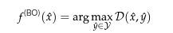
Bayes error rate: error rate of the Bayes optimal classifier, and the best error rate you can ever hope to achieve on this classification problem. 
Parity function: inspect every feature to make a prediction

Sources of error
Inductive bias: a set of assumptions made by an algorithm. 
    Ex. Shallow decision tree would be good at learning a function like 'students only like AI courses', but not so good at 'if this studnet has liked an odd nuber of their past coureses, they will like the next one". 
Noise in data - feature level and label level
    Ex. Student writes a scathingly negative review for a course, but accidently click 5* (label level). Typo in the review (feature level)
Features available for learning is insufficient
    Ex. Made mistake when downloading data, only dl first 5 reviews of each course
May not have a single correct answer
    Ex. label what may be considered offensive (as ppl find different content offensive)

Underfitting: had the opportunity to learning something but didn't
    Ex. empty decision tree, just guesses one answer
Overfitting: pay too much attention of idiosyncracies of training data, can't generalize. 
    Ex. a decision tree with a node for each example

Seperate training & test data (usually 90/10 if you have a lot of data)
Development data: seperate from training & test data, for tuning hyperparameters
General appoarch: 
1. split data into training data, development data, and test data
2. for each possible setting of the hyperparameter, train a model using that setting of hyperparameters and then compute the model's error rate on the development data
3. choose the one that achieved the lowest error rate on development data
4. evaluate that model on the test data to estimate future test performance

Model: tells us what sort of things we can learn and its inductive bias
Parameters: we use the data to decide on, what the algorithm has to figure out. 
    Ex. decision tree learning algorithm needs to take the data and figure out the parameters, i.e. specific questions to ask, classification decisions at the leaves
Hyperparamters: additional knobs that you can adjust, using to tune the inductive bias of algorithms
    Ex. maximum depth for the decision trees 

IRL applications of ML: 
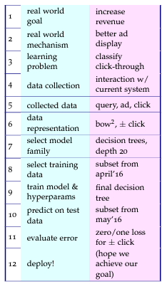
Oracle experiment: assume everything below some line can be solved perfectly, and measure how much impact that will have on a higher line
    Ex. if classifier is perfect, how much money would we make? Use this to decide whether this problem is worth tackling

# Ch3: Geometry and nearest neighbors 
Mapping data set to a feature vector
 - real-valued features get copied directly
 - binary features -> 0/1
 - categorical features -> v-many binary indicator features (i.e. isYellow vector, 0/1 value)

Methods to compute distance between feature vectors
Euclidean distance: 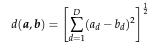

Nearest neighbours: prone to overfitting as it only looks at the neighbour closest to it
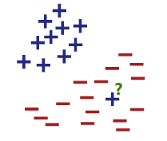
K-nearest neighbours: solves the problem above by looking at the k nearest neighbors
k: hyperparameter

Inductive bias of k-neighbours
 - assumes nearby points should have the same label
 - assumes all features are eequally important 
 - feature scaling (i.e. distingushing between ski and snowboard based on width and height. If width is given in mm and height is in cm, then it will almost purely based on height)

Steps to the algorithm
1. compute distance from test point to all training points
2. points are sorted according to distance
3. sum the class labels for each of the K nearest neighbours and using the sign of this sum as our predictions

K-means clustering: represent each cluster by it's cluster center
Steps to find this center: 
1. guess the clsuter centers
2. assign data point to closest center
3. recomputer cluster center
4. repeat until clusters stop moving
Hyperparameters: number of clusters

Curse of dimensionality
Computational: slow for a very large data set, as you must look at every training example every time you want to make a prediction. You can split the plane into a grid, and only train points in the grid cell of the test point. However it is not realistic in higher dimensions as the number of cells is too large. 
Mathematical: math gets weird when working in higher dimensions, as many of your intuitions don't carry over. Most notably, in moderately high dimensions, all distances become equal and it makes it hard for knn to accurately distinguish clusters.

Solutions
Dimension reduction

# Ch4: The perceptron
Perceptron algorithm: can learn weights for features. Based on how neurons work. The sign of the sum of weights (w) & input vectors (x), which is called the activation, determine if the neuron 'fires'. 
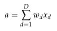
To have a non-zero threshold, introduce a bias term b. 
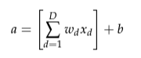
Steps of the algorithm: 
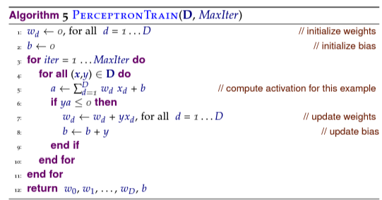
notes: 
1. since y is -1 if the neuron doesn't fire and +1 if it does, ya will be > 0 if they have the same sign and < 0 if they don't. Thus the algorithm only updates the weight if the algorithm predicts wrong. 
2. algorithm looks at one example at a time

Hyperparameter: 
MaxIter: how many times it passes through the data. Too many -> overfitting, too little -> underfitting

Permuting: permute the order of examples at the beginning of each iteration to yield ~20% savings in # of iterations (in practice). 

Geometric interpretation: 
If we think of the weights as a vector w, then the decision boundary is simply the plane perpendicular to w. Note that the scale of the weight vector is irrelevant as only the sign matters, so its common to work with normalized weight vectors. 

Scaling features: if you want to find how sensitive the final classification is to a feature, you can sort all the weights from largest to smallest and select the ones at the top and bottom. However if w1 == w2 yet x1 can take the values 0, 1, and x2 can take on values between 0 and 100, then in practice, x2 (100*w2) can over-dominate x1 (1*w1). To fix this, scale the features appropriately before using perceptron algorithm. 

Does this algorithm converge?
It converges only if the data is linearly separable, i.e. if there exists a hyperplane that separates all the + examples and - examples. 
Margin: the distance between the hyperplane that separates the data and nearest point. 
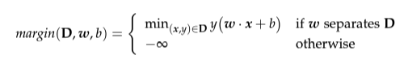
Margin of a data set: 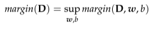

Perceptron convergence theorem: 
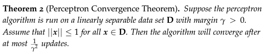
Do understand the proof but don't need to know it 

Voted perceptron: hyperplanes get votes based on how long they survived, and the prediction on a test point would be 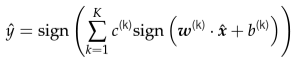, where c is the survival times for each weight vector. Impractical as you need to store weight vectors with their counts for every update, and super slow
Average perceptron: similar to voted perceptron except you maintain a running rum of hte averaged weight vector and average bias. 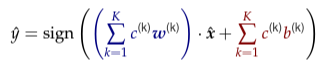

Limitations: decision boundaries has to be linear. Can't do stuff like the XOR problem. 

# Ch5: Practical issues
Image recognition: 
- Pixel representation
- patch representation
- shape representation 
Text categorization:
- bag of words

Good features: all of the above representation throw out all position information outside of itself. Shape rep also throws our color and pixel info. Shows how picking the right features is important

Redundant features: 2 features that are highly correlated. KNN has the most problems with this because distance looks the same the higher dimension you get. 

Feature pruning: removing features that appear a very small number of times or too often. To not prune away all the interesting features, look for features with low variance to prune. 

Normalization: 
- feature normalization: go through each feature and adjust it the same way across all examples. Centering and scaling so that either each feature has variance 1 across the training data, or each feature is between -1 and 1. *Note that if the difference in scale is significant, or if it's binary data, maybe don't throw it away
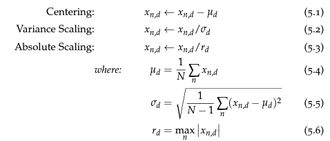
- example normalization: each example is adjusted individually, i.e. every example vector is one. 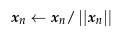

Combinatorial transformations
Logarithmic transformation: both knn and perceptrons can use this so that the boundary can be logarithmic instead of linear. Ex. difference between seeing 'excellent' once vs. twice is more significant than seeing it 5 times vs. 6 times when classifying + or - review. 

Evaluating model performance
Binary Classification problems: 
Spotting problems (X vs. Not X): 
- Precision/recall: 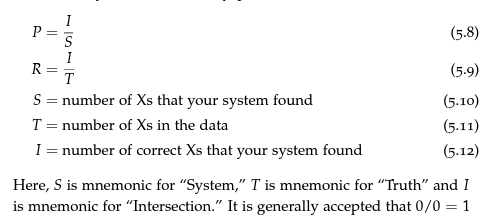
    - Precision: actual predicted Xs/predicted Xs
    - recall: predicted Xs/actual Xs
    - Precision/recall curves: algorithm can create confidence instead of just yes/no. Can set threshold 
    - F score (harmonic mean): 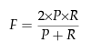
    - weighted f-measure (precision is more important with parameter beta, where beta = 0 focuses entirely on recall, and beta = 1 is standard): 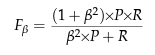
- Sensitivity/specificity: 
    - sensitivity: finds everything its looking for (high recall)
    - specificity: doesn't find the things it doesn't want to find
    - Receiver operating characteristic (ROC) curve: plots sensitivity against 1 - specificity 
    - Find AUC given ROC

Cross Validation: Have value K that determines how many parts you split up your data into, usually 10. 9 of them are used for learning algorithm, and the last is for test. You do this 10 times, and one part is used as the test data once. Average your performance over all 10 parts to get an estimate of how well the model will perform. Then choose one of the models as your final model, or train the model on all the data. 
- Leave one out (LOO): train all the data except one. Best for KNN as it is less computationally expensive than others
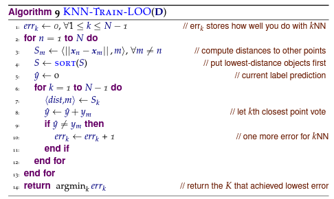

Hypothesis testing
- Paired t-: parametric test. Can't easily be applied to f-scores, can use cross validation to get over it. 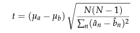
- Bootstrapping: get random (repeatable) draws from the same data set, simulating getting points from distribution. Can compute f-score, CIs, means, SDs, etc. Takes true labels y, predicted labels y hat, and # of folds to run on. 

Debugging
- Generalization of test data: too many features, low quality features, low quality data, or not enough data
- train/test mismatch: Try shuffling training data and select a new set 
- algorithm implementation: is it optimizating what you think it should be optimizating, try making data sets with expected behaviour to try 
- adequete implementation: if you can't fit training data, your feature may not be rich enough. Try cheating by adding a feature that matches tru value 1-1 and see if it works. If it doens't, maybe too much noise, too little data, or too many features.
- data amount: try training on 80% of data and see how much it hurts performance

Bias/Variance trade-off: 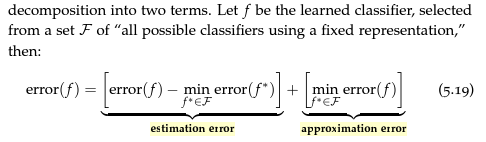
- Approximation error (bias): quality of the model family. Ex. a classifier that predicts true every time is clearly biased, so high apporximation error.
- estimation error (variance trade off): how far the actual learned classifier f is from optimal classifer f*. Ex. a classifier that predicts true every time has low estimation error.

# Ch6: Beyond binary classification
Imbalanced data: ex. 1% fraud and 99% not fraud
- Subsampling: throw out most of not fraud data to get 50-50 of both  
- Weighting: give not fraud examples less weight, so that the weight of both will add up to 50-50

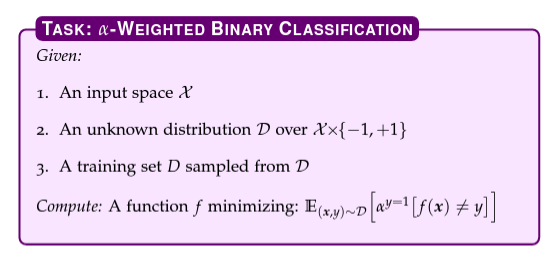
Where alpha is how many times the positive class is alpha times as important as the negative class.

Most reference images and notes are not in the textbook yet, which makes parts difficult to understand, so we'll end here. This much is enough for CS224 natural language processing with deep learning

